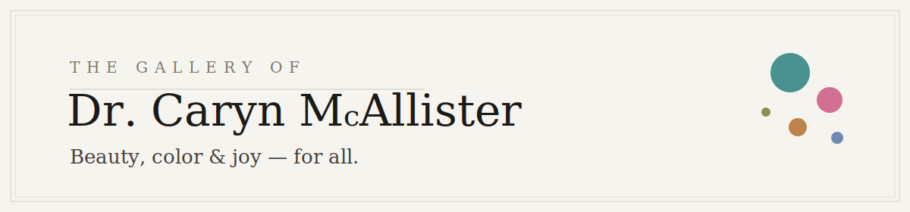

<p align="center">
  <picture>
    <source media="(prefers-color-scheme: dark)" srcset="assets-readme/hero-banner-dark.svg" />
    
  </picture>
</p>

<p align="center">
  
  
  
  
  
</p>

<p align="center">
  <em>A one-page gallery site for Dr. Caryn McAllister — a Connecticut doctor of physical therapy whose
  gallery pairs original watercolors, acrylics and mixed media with one mission: greater access to
  healthcare for all. Quiet editorial layout, museum lightbox, and not a single framework in sight —
  three hand-written files you can read over coffee.</em>
</p>

---

### `/// WHAT IT IS`

```
┌─────────────────────────────────────────────────────────────────────────┐
│ HERO          Serif headline with an inline painting "chip", floating   │
│               polaroid card, mouse parallax, scrolling ticker           │
├─────────────────────────────────────────────────────────────────────────┤
│ 01 ON VIEW    Drag-to-explore rail of six highlights, oversized         │
│               italic numerals, scroll-snap on touch                     │
├─────────────────────────────────────────────────────────────────────────┤
│ 02 COLLECTION 22 works in a masonry grid — filter chips                 │
│               (Florals · Land & Sea · Menagerie · Abstract),            │
│               numbered catalogue captions, cursor "View" bubble         │
├─────────────────────────────────────────────────────────────────────────┤
│ QUOTE         Full-bleed band over a darkened painting                  │
├─────────────────────────────────────────────────────────────────────────┤
│ 03 THE GALLERY  Founder & director, mission, socials                    │
├─────────────────────────────────────────────────────────────────────────┤
│ 04 INQUIRE    "Bring a piece home." → Instagram DM                      │
└─────────────────────────────────────────────────────────────────────────┘
│ LIGHTBOX      Any artwork → full-screen viewer: arrows, keyboard,       │
│               swipe, piece counter, per-piece inquiry link              │
└─────────────────────────────────────────────────────────────────────────┘
```

---

### `/// HIGHLIGHTS`

```
TYPOGRAPHY    Cormorant Garamond display serif over Inter micro-caps —
              a fine-gallery pairing on paper-white #f6f4ef.

MOTION        Intro curtain (once per session), scroll reveals, floating
              polaroid, hero parallax, seamless ticker — all honoring
              prefers-reduced-motion.

MOBILE        Not a squeezed desktop: full-width CTAs, swipe rails,
              horizontal filter chips, thumb-pill lightbox arrows.

IMAGES        Every photographed frame was cropped to the artwork;
              lazy-loading with per-piece watercolor wash placeholders.

ZERO ANYTHING No framework, no bundler, no npm. index.html + styles.css
              + app.js. Google Fonts is the only external request.
```

---

### `/// RUN IT`

```bash
# it's a static site — any server works
cd mcallister-gallery
python3 -m http.server 8000
# → http://localhost:8000
```

Or just open `index.html` in a browser.

---

### `/// EDIT THE COLLECTION`

Every artwork lives in one array at the top of [`app.js`](app.js):

```js
{ slug: "meadow", title: "Meadow Song", medium: "Acrylic on canvas",
  size: "", cat: "landscapes", wash: "#2c827f" },
```

- **Rename a piece** → edit `title`.
- **Add dimensions** → fill `size` (e.g. `"11 × 14 in"`) — it appears in captions and the viewer automatically.
- **Swap the highlights rail** → the `FEATURED` slug list right below.
- **Add a work** → drop a `.jpg` in `assets/art/` and add one line.

`?flat` on any URL disables animations — handy for pixel-perfect screenshots.

---

### `/// DEPLOY`

Push to GitHub → import in [Vercel](https://vercel.com/new) → framework preset **Other**, no build command,
output directory `.` — done. `vercel.json` already ships clean URLs and immutable caching for `assets/`.
After the first deploy, update the `og:url` / `og:image` domain in `index.html` if the project name differs.

---

### `/// RIGHTS`

Code is MIT — take what you like. The paintings and their photographs are **© Dr. Caryn McAllister
Gallery, all rights reserved**, and are not covered by the code license.

<p align="center"><em>Beauty, color &amp; joy — for all.</em></p>
